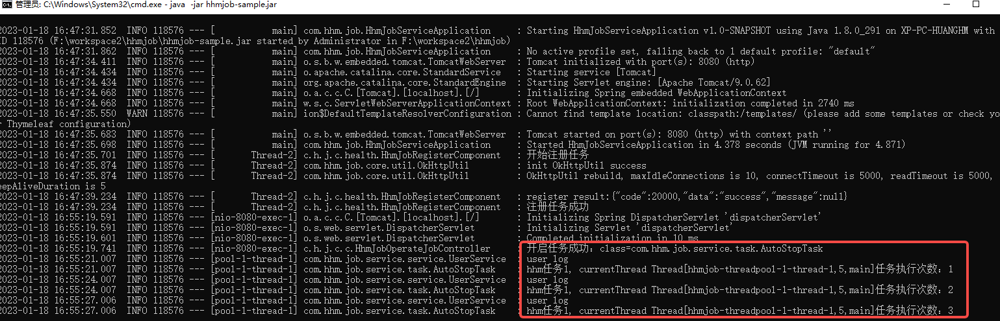

# 一 概述
hhm-job是一个可动态调节定时任务的平台。核心特点是方便接入、快速上手，保证定时任务灵活调度。

# 二 支持功能
1. 可以随时停止和开始定时任务。真正意义上的停止，而不是让定时任务空跑。
2. 可动态调整定时任务的执行频率。
3. 可监测某个任务节点的健康状态，从而动态调节某个任务的执行节点数量。
4. 可很方便的看某个任务的某个节点的执行日志。（只看该任务相关的日志，没有其它日志干扰）

# 三 快速上手
3.1 从github把`hhmjob-admin-1.0.0.jar`和`hhmjob-sample-1.0.0.jar`下载  

3.2 分别运行
    ```
    java -jar hhmjob-admin-1.0.0.jar
    java -jar hhmjob-sample-1.0.0.jar
    ```  

3.3 访问 `http://localhost:9090/index.html`, 看到如下页面


3.4 点击新增任务，如以下输入信息
   >任务名称：随便填  
   > class: com.hhm.job.service.task.AutoStopTask  
   > cron:  */3 * * * * ?  
   > taskNum: 1
   >

点击确定，看到以下信息


3.5 点击启动，稍等一会，看 `hhmjob-sample-1.0.0.jar` 的执行窗口，任务正在执行

   
也可点击页面的查看日志，查看该任务的执行日志（只看任务的相关日志，节点的其它日志不展示）。


3.6 点击`停止` 按钮，观察日志，任务停止成功。


3.7 演示多节点
复制 `hhmjob-sample-1.0.0.jar` 到一个新的文件夹，在文件夹底下新建一个application.yml，里面配置新的端口`8082`，启动，观察页面

可以看到注册成功

启动任务，

看到节点1正在执行


编辑启动节点数据，改为2

看到另外一个节点也开始了运行


# 四 快速接入
4.1 在项目引入 `hhmjob-core-1.0.0.jar`，可下载jar包然后lib方式引入，或者导入到maven仓库maven引入
4.2 编写任务类，继承 `HhmJobAbstractTask` ，重写 `doJob()`方法， 然后编写任务逻辑，如下所示
```java
@Component
@Slf4j
public class AutoStopTask2 extends HhmJobAbstractTask {
    @Resource
    private UserService userService; // 一个类注入的例子
    private int count;

    @Override
    public void doJob() {
        userService.test();
        log.info("hhm任务2, currentThread {}任务执行次数：{}",  Thread.currentThread(), count + 1);
        count++;
    }
}
```
4.3 在配置文件中配置hhmjob-admin的地址
```properties
hhm.job.registerUrl=http://127.0.0.1:9090
```
至此完成，然后执行3.4步骤开启你的任务

# 五 注意点
由于我是把vue打包放到springboot底下进行部署前端的，设置了一个 `src/main/resources/public/config.js` 来存储admin的ip和端口，从而达到前后端交互的目的，
因此若想重新部署hhmjob-admin，需把hhmjob-admin源码下载，修改 `src/main/resources/public/config.js` 里面的ip和端口，保持和部署服务器一致，然后打包再执行。（若有改进办法欢迎不吝赐教）
